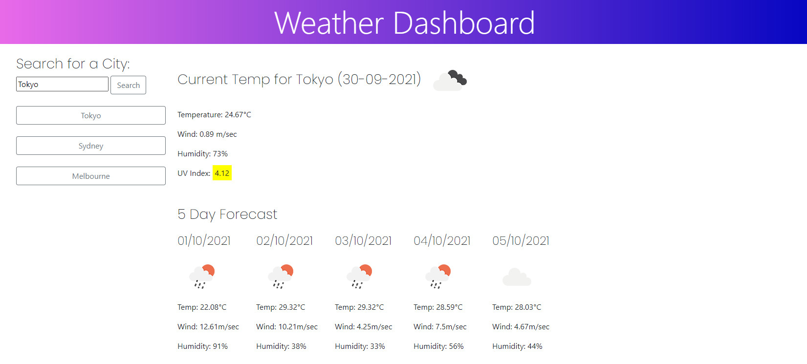

# Weather Dashboard

This weather dashboard allows users to enter in a city and search for the current weather of that city, as well as a 5 day forecast.

A validation message is added to ensure users do not leave the city field blank.
The cities that have been searched for is saved into local storage, and will be found underneath the search bar so users can simply click on the previous search to search again. 

## Demo 

## Deployed application

https://annanguyen1.github.io/Weather-Dashboard/
